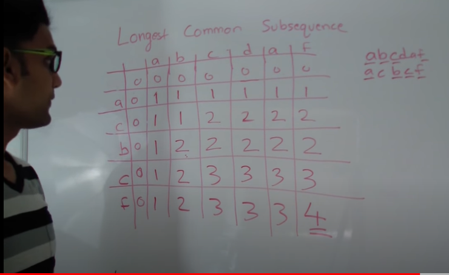

# 1143. Longest Common Subsequence \(LCS\)

## Concept

```text
Famously known as LCS
```



```cpp
// dp[i][j] = t1[0..i] and t2[0..j]
int longestCommonSubsequence(string t1, string t2) {
        int n = t1.size();
        int m = t2.size();
        
        // vector<vector<int>> dp(n + 1, vector<int>(m + 1, 0));
        vector<vector<int>> dp(2, vector<int>(m + 1, 0));
        
        for(int i = 1; i <= n; i++){
            for(int j = 1; j <= m; j++){
                if(t1[i - 1] == t2[j - 1])
                    dp[i % 2][j] = 1 + dp[(i - 1) % 2][j - 1];
                else
                    dp[i % 2][j] = max(dp[(i - 1) % 2][j], dp[i % 2][j - 1]);
            }
        }
        
        return dp[n % 2][m];
    }
```

Normal botttom up DP requires **O\(nm\)** space

SO, **we replace the dp matrix with 2 rows.** i -&gt; i % 2 and \(i - 1\) -&gt; \(i - 1\) % 2

So, now the **SC = O\(2 \* m\)**

