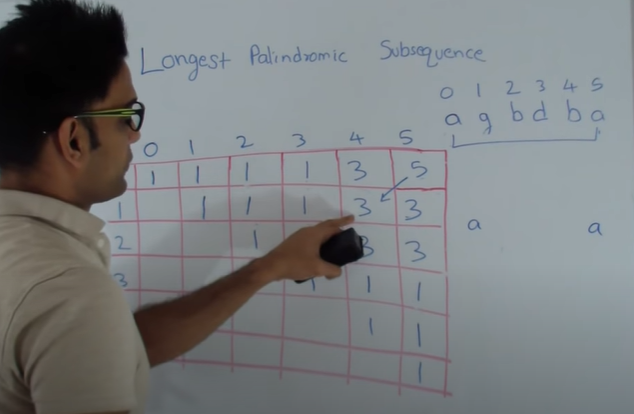

# 516. Longest Palindromic Subsequence \(LPS\)

Famously called as LPS

Same string problem, so **diagonal type dp matrix. Same string is used on both sides of the matrix**




```cpp
// dp[i][j] = str[i..j]
int lps(string str) {
    int n = str.size();
    vector<vector<int>> dp(n, vector<int>(n, 0));
    
    // 1 len
    for(int i = 0; i < n; i++){
        dp[i][i] = 1;
    }
    
    // 2 len
    for(int i = 0; i < n - 1; i++){
        dp[i][i+1] = (str[i] == str[i+1]) ? 2 : 1;        
    }
    
    // 3.. lens
    for(int l = 3; l <= n; l++){
        for(int i = 0; i <= n - l; i++){
            int j = i + l - 1;
            
            if(str[i] == str[j])
                dp[i][j] = 2 + dp[i+1][j-1];
            else
                dp[i][j] = max(dp[i+1][j],dp[i][j-1]);
        }
    }
    
    return dp[0][n-1];
}
```


